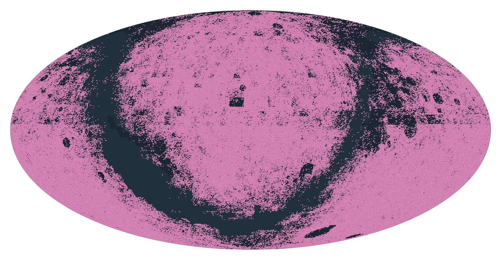

# starplot-hyperleda

HyperLeda catalog builder for [Starplot](https://github.com/steveberardi/starplot), which contains 983,261 galaxies (plotted above as pink markers).

1. `make install` to create virtual environment
2. `make build` to build catalog Parquet file
3. `make release` to create release (only run from GitHub action)

---

## Acknowledgements

Data for this catalog was obtained from:

- [HyperLeda - Catalog of galaxies : VII/237](https://cdsarc.cds.unistra.fr/viz-bin/cat/VII/237) (positions, geometry)
- [Automatic extraction for millions of galaxies](https://aas.aanda.org/articles/aas/abs/2000/16/ds1851/ds1851.html). G. Paturel, Y. Fang, R. Garnier, C. Petit and J. Rousseau; 2000, Astron. Astrophys. Suppl. Ser., 146, 19 (via HyperLeda database (http://leda.univ-lyon1.fr)) (magnitude, in B band)

